 

# SOLID İlkeleri (Principles)

SOLID, yazılım tasarımlarını daha anlaşılır, esnek ve sürdürülebilir hale getirmeyi amaçlayan beş tasarım ilkesini ifade eden bir kısaltmadır.

 

---

 

## SOLID İlkeleri nelerdir?

 

 
 
Bu ilkeler Robert C. Martin tarafından geliştirilmiştir, Michael Feathers tarafından SOLID adı altında ortaya çıkmıştır ve yazılım geliştirmede yaygın olarak kabul gören en iyi uygulamalardır.
 
 
 

## [🔗 SRP — Single Responsibility Principle](https://github.com/tanerceker/solid-principles/tree/main/solid-principles/SRP)

Bu ilke, bir sınıfın değişmek için tek ve yalnızca bir nedeni olması gerektiğini belirtir. Başka bir deyişle, bir sınıfın yalnızca bir işi veya sorumluluğu olmalıdır. Bu, sistemin yönetilmesini kolaylaştırır ve değişiklikler yapıldığında kodun kırılma potansiyelini azaltır.
 
 

## [🔗 OCP — Open-Closed Principle](https://github.com/tanerceker/solid-principles/tree/main/solid-principles/OCP)

Bu ilke, yazılım varlıklarının (entities) (sınıflar, modüller, fonksiyonlar, vb.) genişletmeye (extension) açık ancak değiştirmeye (modification) kapalı olması gerektiğini belirtir. Bu, bir sisteme mevcut kodunu değiştirmeden yeni özellikler veya işlevler ekleyebilmeniz gerektiği anlamına gelir. Nesnenin davranışını genişletebilirsiniz, ancak kaynak kodunu değiştirmemelisiniz.
 
 

## [🔗 LSP — Liskov Substitution Principle](https://github.com/tanerceker/solid-principles/tree/main/solid-principles/LSP)

Bu ilke, bir program bir Temel sınıf (Base class) kullanıyorsa, programın haberi olmadan Alt sınıflarından (Subclasses) herhangi birini kullanabilmesi gerektiğini öne sürer. Esasen, alt sınıflar programın doğruluğunu etkilemeden temel sınıflarıyla değiştirilebilir olmalıdır.
 
 

## [🔗 ISP — Interface Segregation Principle](https://github.com/tanerceker/solid-principles/tree/main/solid-principles/ISP)

Bu ilke, istemcilerin kullanmadıkları arayüzlere (interfaces) bağımlı olmaya zorlanmaması gerektiğini belirtir. Başka bir deyişle, bir sınıf kullanmadığı yöntemleri uygulamak (implement) zorunda olmamalıdır. Bu ilke, sınıfların çok özel arayüzlere (specific interfaces) sahip olduğu ve ihtiyaç duymadıkları yöntemlerle aşırı yüklenmedikleri bir sisteme yol açar.
 
 

## [🔗 DIP — Dependency Inversion Principle](https://github.com/tanerceker/solid-principles/tree/main/solid-principles/DIP)

Bu ilke, somutlaştırmalara (concretions) değil soyutlamalara (abstractions) bağımlı olunması gerektiğini vurgular. Yüksek seviyeli modüller (High-level modules)
Düşük seviyeli modüllere (Low-level modules) bağımlı olmamalıdır. Her ikisi de soyutlamalara (abstractions) bağlı olmalıdır. Bu, sistemi daha modüler hale getirerek ölçeklenebilirliği (scalability) teşvik eder ve bağlantıyı (coupling) azaltır.
 
 
 

---

Bu ilkelerin anlaşılması ve uygulanması, daha sürdürülebilir, ölçeklenebilir ve anlaşılabilir olan daha yüksek kaliteli yazılımlara yol açabilir. Bununla birlikte, tüm ilkeler gibi bunların da katı ve kesin kurallar olmadığını belirtmek önemlidir. Bunun yerine, rehberlik sağlarlar ve özel bağlamınıza ve ihtiyaçlarınıza göre uyarlanmalıdırlar.
